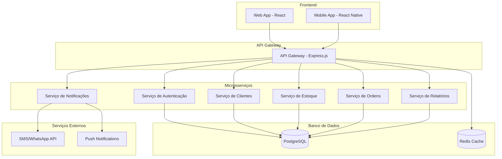
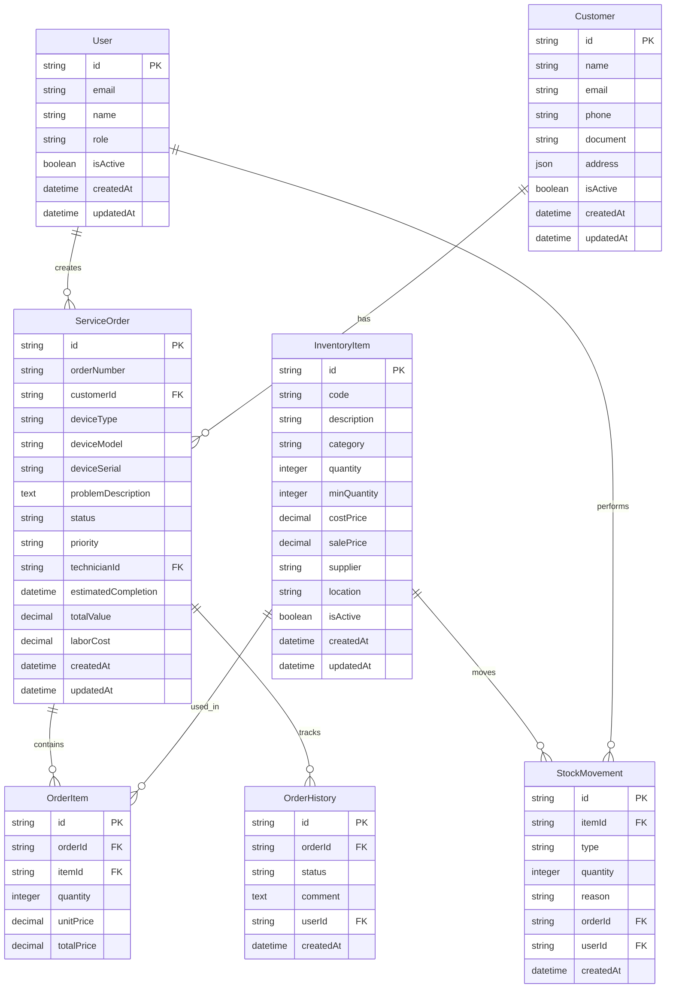

# Documento de Design - Sistema de Gerenciamento de Assistência Técnica

## Visão Geral

O sistema será desenvolvido como uma aplicação web moderna com arquitetura de microsserviços, incluindo um aplicativo mobile nativo para clientes. A solução utilizará tecnologias modernas para garantir escalabilidade, performance e facilidade de manutenção.

## Arquitetura

### Arquitetura Geral



### Stack Tecnológico

**Frontend Web:**
- React 18 com TypeScript
- Material-UI para componentes
- React Query para gerenciamento de estado
- React Router para navegação
- Vite como bundler

**Mobile:**
- React Native com TypeScript
- React Navigation
- React Native Paper para UI
- AsyncStorage para cache local
- Push Notifications (Firebase)

**Backend:**
- Node.js com TypeScript
- Express.js para API REST
- Prisma ORM para banco de dados
- JWT para autenticação
- Socket.io para real-time
- Bull Queue para jobs assíncronos

**Banco de Dados:**
- PostgreSQL como banco principal
- Redis para cache e sessões
- Backup automático diário

**Infraestrutura:**
- Docker para containerização
- Docker Compose para desenvolvimento
- Nginx como proxy reverso
- PM2 para gerenciamento de processos

## Componentes e Interfaces

### 1. Serviço de Autenticação

**Responsabilidades:**
- Autenticação de usuários
- Gerenciamento de sessões
- Controle de permissões por perfil

**Endpoints Principais:**
```typescript
POST /auth/login
POST /auth/logout
POST /auth/refresh
GET /auth/profile
PUT /auth/profile
```

**Modelos:**
```typescript
interface User {
  id: string;
  email: string;
  name: string;
  role: 'ADMIN' | 'MANAGER' | 'TECHNICIAN' | 'ATTENDANT';
  isActive: boolean;
  createdAt: Date;
  updatedAt: Date;
}

interface Session {
  id: string;
  userId: string;
  token: string;
  expiresAt: Date;
}
```

### 2. Serviço de Clientes

**Responsabilidades:**
- Cadastro e gerenciamento de clientes
- Histórico de serviços por cliente
- Validação de dados

**Endpoints Principais:**
```typescript
GET /customers
POST /customers
GET /customers/:id
PUT /customers/:id
DELETE /customers/:id
GET /customers/:id/history
```

**Modelos:**
```typescript
interface Customer {
  id: string;
  name: string;
  email?: string;
  phone: string;
  document: string; // CPF/CNPJ
  address: Address;
  isActive: boolean;
  createdAt: Date;
  updatedAt: Date;
}

interface Address {
  street: string;
  number: string;
  complement?: string;
  neighborhood: string;
  city: string;
  state: string;
  zipCode: string;
}
```

### 3. Serviço de Estoque

**Responsabilidades:**
- Controle de peças e dispositivos
- Movimentação de estoque
- Alertas de estoque mínimo
- Relatórios de giro

**Endpoints Principais:**
```typescript
GET /inventory/items
POST /inventory/items
GET /inventory/items/:id
PUT /inventory/items/:id
POST /inventory/movements
GET /inventory/movements
GET /inventory/alerts
```

**Modelos:**
```typescript
interface InventoryItem {
  id: string;
  code: string;
  description: string;
  category: string;
  quantity: number;
  minQuantity: number;
  costPrice: number;
  salePrice: number;
  supplier?: string;
  location?: string;
  isActive: boolean;
  createdAt: Date;
  updatedAt: Date;
}

interface StockMovement {
  id: string;
  itemId: string;
  type: 'IN' | 'OUT' | 'ADJUSTMENT';
  quantity: number;
  reason: string;
  orderId?: string;
  userId: string;
  createdAt: Date;
}
```

### 4. Serviço de Ordens de Serviço

**Responsabilidades:**
- Gerenciamento de ordens de serviço
- Controle de status e histórico
- Orçamentos e aprovações
- Integração com estoque

**Endpoints Principais:**
```typescript
GET /orders
POST /orders
GET /orders/:id
PUT /orders/:id
POST /orders/:id/status
GET /orders/:id/history
POST /orders/:id/items
```

**Modelos:**
```typescript
interface ServiceOrder {
  id: string;
  orderNumber: string;
  customerId: string;
  deviceType: string;
  deviceModel: string;
  deviceSerial?: string;
  problemDescription: string;
  status: OrderStatus;
  priority: 'LOW' | 'MEDIUM' | 'HIGH' | 'URGENT';
  technicianId?: string;
  estimatedCompletion?: Date;
  totalValue?: number;
  laborCost?: number;
  createdAt: Date;
  updatedAt: Date;
}

enum OrderStatus {
  RECEIVED = 'RECEIVED',
  ANALYZING = 'ANALYZING',
  WAITING_PARTS = 'WAITING_PARTS',
  IN_REPAIR = 'IN_REPAIR',
  TESTING = 'TESTING',
  READY = 'READY',
  DELIVERED = 'DELIVERED',
  CANCELLED = 'CANCELLED'
}

interface OrderItem {
  id: string;
  orderId: string;
  itemId: string;
  quantity: number;
  unitPrice: number;
  totalPrice: number;
}

interface OrderHistory {
  id: string;
  orderId: string;
  status: OrderStatus;
  comment?: string;
  userId: string;
  createdAt: Date;
}
```

### 5. Serviço de Notificações

**Responsabilidades:**
- Envio de SMS e WhatsApp
- Push notifications para mobile
- Templates de mensagens
- Histórico de envios

**Endpoints Principais:**
```typescript
POST /notifications/sms
POST /notifications/whatsapp
POST /notifications/push
GET /notifications/templates
POST /notifications/templates
```

### 6. Serviço de Relatórios

**Responsabilidades:**
- Dashboard com indicadores
- Relatórios de vendas e estoque
- Relatórios de produtividade
- Exportação em PDF/Excel

**Endpoints Principais:**
```typescript
GET /reports/dashboard
GET /reports/sales
GET /reports/inventory
GET /reports/productivity
POST /reports/export
```

## Modelos de Dados

### Diagrama de Entidades



## Tratamento de Erros

### Estratégia de Tratamento

1. **Validação de Entrada:**
   - Validação no frontend com feedback imediato
   - Validação no backend com mensagens padronizadas
   - Sanitização de dados de entrada

2. **Códigos de Erro HTTP:**
   - 400: Bad Request (dados inválidos)
   - 401: Unauthorized (não autenticado)
   - 403: Forbidden (sem permissão)
   - 404: Not Found (recurso não encontrado)
   - 409: Conflict (conflito de dados)
   - 500: Internal Server Error (erro interno)

3. **Estrutura de Resposta de Erro:**
```typescript
interface ErrorResponse {
  error: {
    code: string;
    message: string;
    details?: any;
    timestamp: string;
    path: string;
  };
}
```

4. **Logging e Monitoramento:**
   - Logs estruturados com Winston
   - Monitoramento de performance
   - Alertas para erros críticos

## Estratégia de Testes

### Testes Unitários
- Jest para testes de lógica de negócio
- Cobertura mínima de 80%
- Mocks para dependências externas

### Testes de Integração
- Supertest para testes de API
- Banco de dados de teste isolado
- Testes de fluxos completos

### Testes E2E
- Cypress para frontend web
- Detox para mobile
- Testes de cenários críticos

### Testes de Performance
- Artillery para testes de carga
- Métricas de response time
- Testes de stress em endpoints críticos

## Segurança

### Autenticação e Autorização
- JWT com refresh tokens
- Controle de acesso baseado em roles (RBAC)
- Sessões com timeout automático

### Proteção de Dados
- Criptografia de dados sensíveis
- HTTPS obrigatório
- Validação e sanitização de inputs

### Auditoria
- Log de todas as operações críticas
- Rastreamento de alterações
- Backup automático com retenção

## Performance e Escalabilidade

### Otimizações
- Cache Redis para consultas frequentes
- Paginação em listagens
- Lazy loading no frontend
- Compressão de assets

### Monitoramento
- Métricas de performance
- Alertas de disponibilidade
- Dashboard de saúde do sistema

### Escalabilidade
- Arquitetura preparada para microsserviços
- Load balancing com Nginx
- Containerização com Docker